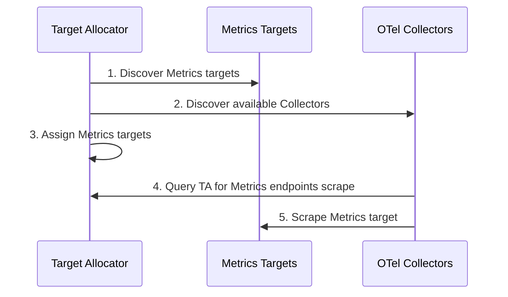
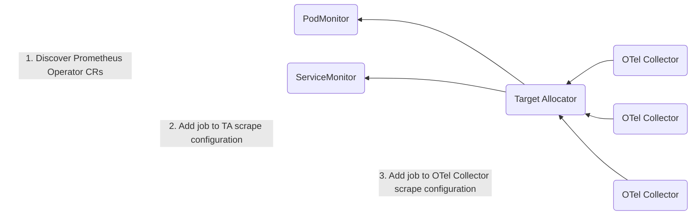

# Target Allocator

Target Allocator is an optional component of the OpenTelemetry Collector [Custom Resource](https://kubernetes.io/docs/concepts/extend-kubernetes/api-extension/custom-resources/) (CR). The release version matches the
operator's most recent release as well.

In a nutshell, the TA is a mechanism for decoupling the service discovery and metric collection functions of Prometheus such that they can be scaled independently. The Collector manages Prometheus metrics without needing to install Prometheus. The TA manages the configuration of the Collector's [Prometheus Receiver](https://github.com/open-telemetry/opentelemetry-collector-contrib/blob/main/receiver/prometheusreceiver/README.md).

The TA serves two functions:
* Even distribution of Prometheus targets among a pool of Collectors
* Discovery of Prometheus Custom Resources

## Even Distribution of Prometheus Targets

The Target Allocator’s first job is to discover targets to scrape and OTel Collectors to allocate targets to. Then it can distribute the targets it discovers among the Collectors. The Collectors in turn query the Target Allocator for Metrics endpoints to scrape, and then the Collectors’ [Prometheus Receivers](https://github.com/open-telemetry/opentelemetry-collector-contrib/blob/main/receiver/prometheusreceiver/README.md) scrape  the Metrics targets. 

This means that the OTel Collectors collect the metrics instead of a Prometheus [scraper](https://uzxmx.github.io/prometheus-scrape-internals.html). 




## Discovery of Prometheus Custom Resources

The Target Allocator also provides for the discovery of [Prometheus Operator CRs](https://github.com/prometheus-operator/prometheus-operator/blob/main/Documentation/user-guides/getting-started.md), namely the [ServiceMonitor and PodMonitor](https://github.com/open-telemetry/opentelemetry-operator/tree/main/cmd/otel-allocator#target-allocator). The ServiceMonitors and the PodMonitors purpose is to inform the Target Allocator (or PrometheusOperator) to add a new job to their scrape configuration. The Target Allocator then provides the jobs to the OTel Collector [Prometheus Receiver](https://github.com/open-telemetry/opentelemetry-collector-contrib/blob/main/receiver/prometheusreceiver/README.md). 



Even though Prometheus is not required to be installed in your Kubernetes cluster to use the Target Allocator for Prometheus CR discovery, the TA does require that the ServiceMonitor and PodMonitor be installed. These CRs are bundled with Prometheus Operator; however, they can be installed standalone as well.

The easiest way to do this is by going to the [Prometheus Operator’s Releases page](https://github.com/prometheus-operator/prometheus-operator/releases), grabbing a copy of the latest `bundle.yaml` file (for example, [this one](https://github.com/prometheus-operator/prometheus-operator/releases/download/v0.66.0/bundle.yaml)), and stripping out all of the YAML except the ServiceMonitor and PodMonitor YAML definitions.

# Usage
The `spec.targetAllocator:` controls the TargetAllocator general properties. Full API spec can be found here: [api.md#opentelemetrycollectorspectargetallocator](../../docs/api.md#opentelemetrycollectorspectargetallocator)

A basic example that deploys.
```yaml
apiVersion: opentelemetry.io/v1alpha1
kind: OpenTelemetryCollector
metadata:
  name: collector-with-ta
spec:
  mode: statefulset
  targetAllocator:
    enabled: true
  config: |
    receivers:
      prometheus:
        config:
          scrape_configs:
          - job_name: 'otel-collector'
            scrape_interval: 10s
            static_configs:
            - targets: [ '0.0.0.0:8888' ]

    exporters:
      logging:

    service:
      pipelines:
        metrics:
          receivers: [prometheus]
          processors: []
          exporters: [logging]
```

In essence, Prometheus Receiver configs are overridden with a `http_sd_config` directive that points to the
Allocator, these are then loadbalanced/sharded to the Collectors. The [Prometheus Receiver](https://github.com/open-telemetry/opentelemetry-collector-contrib/blob/main/receiver/prometheusreceiver/README.md) configs that are overridden
are what will be distributed with the same name.

## PrometheusCR specifics

TargetAllocator discovery of PrometheusCRs can be turned on by setting
`.spec.targetAllocator.prometheusCR.enabled` to `true`, which it presents as scrape configs
and jobs on the `/scrape_configs` and `/jobs` endpoints respectively.

The CRs can be filtered by labels as documented here: [api.md#opentelemetrycollectorspectargetallocatorprometheuscr](../../docs/api.md#opentelemetrycollectorspectargetallocatorprometheuscr)

The Prometheus Receiver in the deployed Collector also has to know where the Allocator service exists. This is done by a
OpenTelemetry Collector Operator-specific config.

```yaml
  config: |
    receivers:
      prometheus:
        config:
          scrape_configs:
          - job_name: 'otel-collector'
        target_allocator:
          endpoint: http://my-targetallocator-service
          interval: 30s
          collector_id: "${POD_NAME}"
```

Upstream documentation here: [PrometheusReceiver](https://github.com/open-telemetry/opentelemetry-collector-contrib/tree/main/receiver/prometheusreceiver#opentelemetry-operator)

The TargetAllocator service is named based on the OpenTelemetryCollector CR name. `collector_id` should be unique per
collector instance, such as the pod name. The `POD_NAME` environment variable is convenient since this is supplied
to collector instance pods by default.


### RBAC
The ServiceAccount that the TargetAllocator runs as, has to have access to the CRs. A role like this will provide that
access.
```yaml
apiVersion: rbac.authorization.k8s.io/v1
kind: ClusterRole
metadata:
  name: opentelemetry-targetallocator-cr-role
rules:
- apiGroups:
  - monitoring.coreos.com
  resources:
  - servicemonitors
  - podmonitors
  verbs:
  - '*'
```
In addition, the TargetAllocator needs the same permissions as a Prometheus instance would to find the matching targets
from the CR instances.
```yaml
apiVersion: rbac.authorization.k8s.io/v1
kind: ClusterRole
metadata:
  name: opentelemetry-targetallocator-role
rules:
- apiGroups: [""]
  resources:
  - nodes
  - nodes/metrics
  - services
  - endpoints
  - pods
  verbs: ["get", "list", "watch"]
- apiGroups: [""]
  resources:
  - configmaps
  verbs: ["get"]
- apiGroups:
  - discovery.k8s.io
  resources:
  - endpointslices
  verbs: ["get", "list", "watch"]
- apiGroups:
  - networking.k8s.io
  resources:
  - ingresses
  verbs: ["get", "list", "watch"]
- nonResourceURLs: ["/metrics"]
  verbs: ["get"]
```
These roles can be combined.

A ServiceAccount bound with the above permissions in the namespaces that are to be monitored can then be referenced in
the `targetAllocator:` part of the OpenTelemetryCollector CR.
```yaml
  targetAllocator:
    enabled: true
    serviceAccount: opentelemetry-targetallocator-sa
    prometheusCR:
      enabled: true
```
**Note**: The Collector part of this same CR *also* has a serviceAccount key which only affects the collector and *not*
the TargetAllocator.

### Service / Pod monitor endpoint credentials

If your service or pod monitor endpoints require credentials or other supported form of authentication (bearer token, basic auth, OAuth2 etc.), you need to ensure that the collector has access to this information. Due to some limitations in how the endpoints configuration is handled, target allocator currently does **not** support credentials provided via secrets. It is only possible to provide credentials in a file (for more details see issue https://github.com/open-telemetry/opentelemetry-operator/issues/1669).

In order to ensure your endpoints can be scraped, your collector instance needs to have the particular secret mounted as a file at the correct path.


# Design

If the Allocator is activated, all Prometheus configurations will be transferred in a separate ConfigMap which get in
turn mounted to the Allocator.    
This configuration will be resolved to target configurations and then split across all OpenTelemetryCollector instances.

TargetAllocators expose the results as [HTTP_SD endpoints](https://prometheus.io/docs/prometheus/latest/http_sd/)
split by collector.

Currently, the Target Allocator handles the sharding of targets. The operator sets the `$SHARD` variable to 0 to allow 
collectors to keep targets generated by a Prometheus CRD. Using Prometheus sharding and target allocator sharding is not
recommended currently and may lead to unknown results.
[See this thread for more information](https://github.com/open-telemetry/opentelemetry-operator/pull/1124#discussion_r984683577)

#### Endpoints
`/scrape_configs`:

```json
{
  "job1": {
    "follow_redirects": true,
    "honor_timestamps": true,
    "job_name": "job1",
    "metric_relabel_configs": [],
    "metrics_path": "/metrics",
    "scheme": "http",
    "scrape_interval": "1m",
    "scrape_timeout": "10s",
    "static_configs": []
  },
  "job2": {
    "follow_redirects": true,
    "honor_timestamps": true,
    "job_name": "job2",
    "metric_relabel_configs": [],
    "metrics_path": "/metrics",
    "relabel_configs": [],
    "scheme": "http",
    "scrape_interval": "1m",
    "scrape_timeout": "10s",
    "kubernetes_sd_configs": []
  }
}
```

`/jobs`:

```json
{
  "job1": {
    "_link": "/jobs/job1/targets"
  },
  "job2": {
    "_link": "/jobs/job1/targets"
  }
}

```

`/jobs/{jobID}/targets`:

```json
{
  "collector-1": {
    "_link": "/jobs/job1/targets?collector_id=collector-1",
    "targets": [
      {
        "Targets": [
          "10.100.100.100",
          "10.100.100.101",
          "10.100.100.102"
        ],
        "Labels": {
          "namespace": "a_namespace",
          "pod": "a_pod"
        }
      }
    ]
  }
}
```

`/jobs/{jobID}/targets?collector_id={collectorID}`:

```json
[
  {
    "targets": [
      "10.100.100.100",
      "10.100.100.101",
      "10.100.100.102"
    ],
    "labels": {
      "namespace": "a_namespace",
      "pod": "a_pod"
    }
  }
]
```


## Packages
### Watchers
Watchers are responsible for the translation of external sources into Prometheus readable scrape configurations and 
triggers updates to the DiscoveryManager

### DiscoveryManager
Watches the Prometheus service discovery for new targets and sets targets to the Allocator 

### Allocator
Shards the received targets based on the discovered Collector instances

### Collector
Client to watch for deployed Collector instances which will then provided to the Allocator. 

