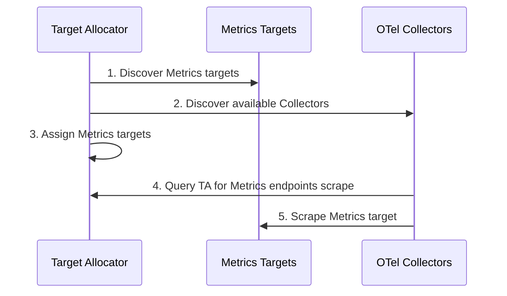
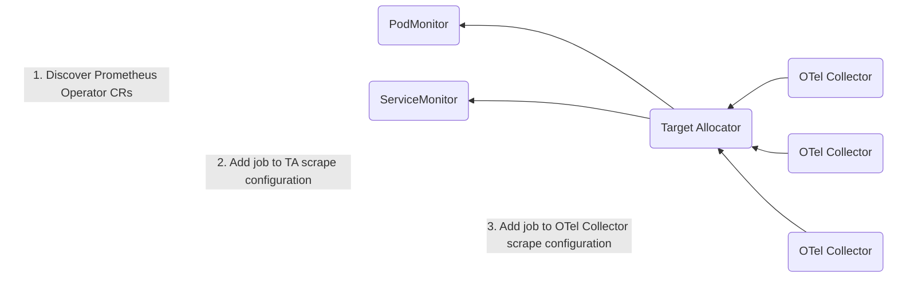

# Target Allocator

Target Allocator is an optional component of the OpenTelemetry Collector [Custom Resource](https://kubernetes.io/docs/concepts/extend-kubernetes/api-extension/custom-resources/) (CR). The release version matches the
operator's most recent release as well.

> 🚨 **Note:** the TargetAllocator currently supports the `statefulset` and `daemonset` deployment modes of the `OpenTelemetryCollector` CR.

In a nutshell, the TA is a mechanism for decoupling the service discovery and metric collection functions of Prometheus such that they can be scaled independently. The Collector manages Prometheus metrics without needing to install Prometheus. The TA manages the configuration of the Collector's [Prometheus Receiver](https://github.com/open-telemetry/opentelemetry-collector-contrib/blob/main/receiver/prometheusreceiver/README.md).

The TA serves two functions:
* Even distribution of Prometheus targets among a pool of Collectors
* Discovery of Prometheus Custom Resources

## Even Distribution of Prometheus Targets

The Target Allocator’s first job is to discover targets to scrape and OTel Collectors to allocate targets to. Then it can distribute the targets it discovers among the Collectors. The Collectors in turn query the Target Allocator for Metrics endpoints to scrape, and then the Collectors’ [Prometheus Receivers](https://github.com/open-telemetry/opentelemetry-collector-contrib/blob/main/receiver/prometheusreceiver/README.md) scrape  the Metrics targets. 

This means that the OTel Collectors collect the metrics instead of a Prometheus [scraper](https://uzxmx.github.io/prometheus-scrape-internals.html). 




### Allocation strategies

Several target allocation strategies are available. Some strategies may only make sense for a given Collector deployment
mode. For example, the `per-node` strategy only works correctly with a Collector deployed as a DaemonSet.

#### `consistent-hashing`

A consistent hashing strategy implementing the [following algorithm][consistent_hashing]. Only the target url is hashed
to prevent label changes from causing targets to be moved between collectors. This strategy consistently assigns
targets to the same collectors, but will experience rebalancing when the collector count changes.

This is the default.

#### `least-weighted`

A strategy that simply assigns the target to the collector with the least number of targets. It achieves more stability
in target assignment when collector count changes, but at the cost of less even distribution of targets.

#### `per-node`

This strategy assigns each target to the collector running on the same Node the target is. As such, it only makes sense
to use it with a collector running as a DaemonSet.

> [!WARNING]  
> The per-node strategy ignores targets not assigned to a Node, like for example control plane components.

[consistent_hashing]: https://blog.research.google/2017/04/consistent-hashing-with-bounded-loads.html
## Discovery of Prometheus Custom Resources

The Target Allocator also provides for the discovery of [Prometheus Operator CRs](https://github.com/prometheus-operator/prometheus-operator/blob/main/Documentation/user-guides/getting-started.md), namely the [ServiceMonitor and PodMonitor](https://github.com/open-telemetry/opentelemetry-operator/tree/main/cmd/otel-allocator#target-allocator). The ServiceMonitors and the PodMonitors purpose is to inform the Target Allocator (or PrometheusOperator) to add a new job to their scrape configuration. The Target Allocator then provides the jobs to the OTel Collector [Prometheus Receiver](https://github.com/open-telemetry/opentelemetry-collector-contrib/blob/main/receiver/prometheusreceiver/README.md). 



Even though Prometheus is not required to be installed in your Kubernetes cluster to use the Target Allocator for Prometheus CR discovery, the TA does require that the ServiceMonitor and PodMonitor be installed. These CRs are bundled with Prometheus Operator; however, they can be installed standalone as well.

The easiest way to do this is to grab a copy of the individual [`PodMonitor`](https://github.com/prometheus-community/helm-charts/blob/main/charts/kube-prometheus-stack/charts/crds/crds/crd-podmonitors.yaml) YAML and [`ServiceMonitor`](https://github.com/prometheus-community/helm-charts/blob/main/charts/kube-prometheus-stack/charts/crds/crds/crd-servicemonitors.yaml) YAML custom resource definitions (CRDs) from the [Kube Prometheus Operator’s Helm chart](https://github.com/prometheus-community/helm-charts/tree/main/charts/kube-prometheus-stack/charts).

> ✨ For more information on configuring the `PodMonitor` and `ServiceMonitor`, check out the [PodMonitor API](https://github.com/prometheus-operator/prometheus-operator/blob/main/Documentation/api.md#monitoring.coreos.com/v1.PodMonitor) and the [ServiceMonitor API](https://github.com/prometheus-operator/prometheus-operator/blob/main/Documentation/api.md#monitoring.coreos.com/v1.ServiceMonitor).

# Usage

The `spec.targetAllocator:` controls the TargetAllocator general properties. Full API spec can be found here: [api.md#opentelemetrycollectorspectargetallocator](../../docs/api.md#opentelemetrycollectorspectargetallocator)

A basic example that deploys.
```yaml
apiVersion: opentelemetry.io/v1beta1
kind: OpenTelemetryCollector
metadata:
  name: collector-with-ta
spec:
  mode: statefulset
  targetAllocator:
    enabled: true
  config:
    receivers:
      prometheus:
        config:
          scrape_configs:
          - job_name: 'otel-collector'
            scrape_interval: 10s
            static_configs:
            - targets: [ '0.0.0.0:8888' ]

    exporters:
      debug: {}

    service:
      pipelines:
        metrics:
          receivers: [prometheus]
          exporters: [debug]
```

In essence, Prometheus Receiver configs are overridden with a `http_sd_config` directive that points to the
Allocator, these are then loadbalanced/sharded to the Collectors. The [Prometheus Receiver](https://github.com/open-telemetry/opentelemetry-collector-contrib/blob/main/receiver/prometheusreceiver/README.md) configs that are overridden
are what will be distributed with the same name.

## TargetAllocator CRD

The `spec.targetAllocator` attribute allows very limited control over the target allocator resources. More customization is possible by using
the `TargetAllocator` CRD. We create the `TargetAllocator` CR, and then add its name in the `opentelemetry.io/target-allocator` label on the respective OpenTelemetryCollector CR.

The basic example from above looks as follows with this setup:

```yaml
apiVersion: opentelemetry.io/v1beta1
kind: OpenTelemetryCollector
metadata:
  name: collector-with-ta
  labels:
    opentelemetry.io/target-allocator: ta
spec:
  mode: statefulset
  config:
    receivers:
      prometheus:
        config:
          scrape_configs:
          - job_name: 'otel-collector'
            scrape_interval: 10s
            static_configs:
            - targets: [ '0.0.0.0:8888' ]

    exporters:
      debug: {}

    service:
      pipelines:
        metrics:
          receivers: [prometheus]
          exporters: [debug]
---
apiVersion: opentelemetry.io/v1alpha1
kind: TargetAllocator
metadata:
  name: ta
spec:
```

Note that the scrape configs can be specified either in the prometheus receiver configuration, or directly in the TargetAllocator CRD. The resultant
target allocator will use both.

## PrometheusCR specifics

TargetAllocator discovery of PrometheusCRs can be turned on by setting
`.spec.targetAllocator.prometheusCR.enabled` to `true`, which it presents as scrape configs
and jobs on the `/scrape_configs` and `/jobs` endpoints respectively.

The CRs can be filtered by labels as documented here: [api.md#opentelemetrycollectorspectargetallocatorprometheuscr](../../docs/api.md#opentelemetrycollectorspectargetallocatorprometheuscr)

Upstream documentation here: [PrometheusReceiver](https://github.com/open-telemetry/opentelemetry-collector-contrib/tree/main/receiver/prometheusreceiver#opentelemetry-operator)

### RBAC

Before the TargetAllocator can start scraping, you need to set up Kubernetes RBAC (role-based access controls) resources. This means that you need to have a `ServiceAccount` and corresponding cluster roles so that the TargetAllocator has access to all of the necessary resources to pull metrics from.

You can create your own `ServiceAccount`, and reference it in `spec.targetAllocator.serviceAccount` in your `OpenTelemetryCollector` CR. You’ll then need to configure the `ClusterRole` and `ClusterRoleBinding` for this `ServiceAccount`, as per below.

```yaml
  targetAllocator:
    enabled: true
    serviceAccount: opentelemetry-targetallocator-sa
    prometheusCR:
      enabled: true
```

> 🚨 **Note**: The Collector part of this same CR *also* has a serviceAccount key which only affects the collector and *not*
the TargetAllocator.

If you omit the `ServiceAccount` name, the TargetAllocator creates a `ServiceAccount` for you. The `ServiceAccount`’s default name is a concatenation of the Collector name and the `-targetallocator` suffix. By default, this `ServiceAccount` has no defined policy, so you’ll need to create your own `ClusterRole` and `ClusterRoleBinding` for it, as per below.

The role below will provide the minimum access required for the Target Allocator to query all the targets it needs based on any Prometheus configurations:

```yaml
apiVersion: rbac.authorization.k8s.io/v1
kind: ClusterRole
metadata:
  name: opentelemetry-targetallocator-role
rules:
- apiGroups: [""]
  resources:
  - nodes
  - nodes/metrics
  - services
  - endpoints
  - pods
  verbs: ["get", "list", "watch"]
- apiGroups: [""]
  resources:
  - configmaps
  verbs: ["get"]
- apiGroups:
  - discovery.k8s.io
  resources:
  - endpointslices
  verbs: ["get", "list", "watch"]
- apiGroups:
  - networking.k8s.io
  resources:
  - ingresses
  verbs: ["get", "list", "watch"]
- nonResourceURLs: ["/metrics"]
  verbs: ["get"]
```

If you enable the the `prometheusCR` (set `spec.targetAllocator.prometheusCR.enabled` to `true`) in the `OpenTelemetryCollector` CR, you will also need to define the following roles. These give the TargetAllocator access to the `PodMonitor` and `ServiceMonitor` CRs. It also gives namespace access to the `PodMonitor` and `ServiceMonitor`.

```yaml
apiVersion: rbac.authorization.k8s.io/v1
kind: ClusterRole
metadata:
  name: opentelemetry-targetallocator-cr-role
rules:
- apiGroups:
  - monitoring.coreos.com
  resources:
  - servicemonitors
  - podmonitors
  verbs:
  - '*'
- apiGroups: [""]
  resources:
  - namespaces
  verbs: ["get", "list", "watch"]
```

> ✨ The above roles can be combined into a single role.


### Service / Pod monitor endpoint credentials

If your service or pod monitor endpoints require authentication (such as bearer tokens, basic auth, OAuth2, etc.), you must ensure that the collector has access to these credentials.

To secure the connection between the target allocator and the collector so that the secrets can be retrieved, mTLS is used. This involves the use of cert-manager to manage the CA, server, and client certificates.

Prerequisites:
- Ensure cert-manager is installed in your Kubernetes cluster.
- Grant RBAC Permissions:

    - The target allocator needs the appropriate RBAC permissions to get the secrets referenced in the Service / Pod monitor.

    -  The operator needs the appropriate RBAC permissions to manage cert-manager resources. The following clusterRole can be used to grant the necessary permissions:

        ```yaml
        apiVersion: rbac.authorization.k8s.io/v1
        kind: ClusterRole
        metadata:
          name:  opentelemetry-operator-controller-manager-cert-manager-role
        rules:
        - apiGroups:
          - cert-manager.io
          resources:
          - issuers
          - certificaterequests
          - certificates
          verbs:
          - create
          - get
          - list
          - watch
          - update
          - patch
          - delete
        ```

- Enable the `operator.targetallocator.mtls` feature gate in the operator's deployment. 


# Design

If the Allocator is activated, all Prometheus configurations will be transferred in a separate ConfigMap which get in
turn mounted to the Allocator.    
This configuration will be resolved to target configurations and then split across all OpenTelemetryCollector instances.

TargetAllocators expose the results as [HTTP_SD endpoints](https://prometheus.io/docs/prometheus/latest/http_sd/)
split by collector.

Currently, the Target Allocator handles the sharding of targets. The operator sets the `$SHARD` variable to 0 to allow 
collectors to keep targets generated by a Prometheus CRD. Using Prometheus sharding and target allocator sharding is not
recommended currently and may lead to unknown results.
[See this thread for more information](https://github.com/open-telemetry/opentelemetry-operator/pull/1124#discussion_r984683577)

#### Endpoints
`/scrape_configs`:

```json
{
  "job1": {
    "follow_redirects": true,
    "honor_timestamps": true,
    "job_name": "job1",
    "metric_relabel_configs": [],
    "metrics_path": "/metrics",
    "scheme": "http",
    "scrape_interval": "1m",
    "scrape_timeout": "10s",
    "static_configs": []
  },
  "job2": {
    "follow_redirects": true,
    "honor_timestamps": true,
    "job_name": "job2",
    "metric_relabel_configs": [],
    "metrics_path": "/metrics",
    "relabel_configs": [],
    "scheme": "http",
    "scrape_interval": "1m",
    "scrape_timeout": "10s",
    "kubernetes_sd_configs": []
  }
}
```

`/jobs`:

```json
{
  "job1": {
    "_link": "/jobs/job1/targets"
  },
  "job2": {
    "_link": "/jobs/job1/targets"
  }
}

```

`/jobs/{jobID}/targets`:

```json
{
  "collector-1": {
    "_link": "/jobs/job1/targets?collector_id=collector-1",
    "targets": [
      {
        "Targets": [
          "10.100.100.100",
          "10.100.100.101",
          "10.100.100.102"
        ],
        "Labels": {
          "namespace": "a_namespace",
          "pod": "a_pod"
        }
      }
    ]
  }
}
```

`/jobs/{jobID}/targets?collector_id={collectorID}`:

```json
[
  {
    "targets": [
      "10.100.100.100",
      "10.100.100.101",
      "10.100.100.102"
    ],
    "labels": {
      "namespace": "a_namespace",
      "pod": "a_pod"
    }
  }
]
```


## Packages
### Watchers
Watchers are responsible for the translation of external sources into Prometheus readable scrape configurations and 
triggers updates to the DiscoveryManager

### DiscoveryManager
Watches the Prometheus service discovery for new targets and sets targets to the Allocator 

### Allocator
Shards the received targets based on the discovered Collector instances

### Collector
Client to watch for deployed Collector instances which will then provided to the Allocator. 

