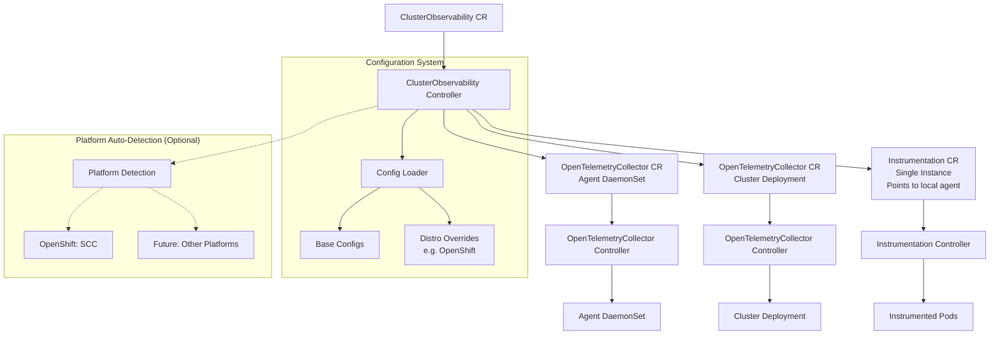
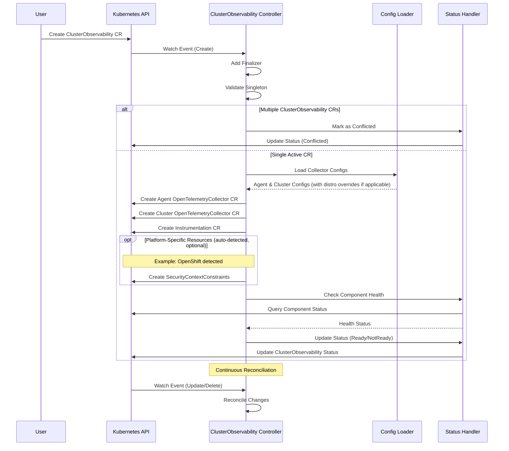

# ClusterObservability Controller

ClusterObservability provides a streamlined way to deploy and manage OpenTelemetry observability components across an entire Kubernetes cluster with a single Custom Resource.

## Overview

ClusterObservability automatically creates and manages:
- **Agent Collector**: DaemonSet for node-level metrics, logs, and host OTLP receiver
- **Cluster Collector**: Deployment for cluster-level k8s metrics and events
- **Auto-Instrumentation**: Single Instrumentation CR for application instrumentation (points to local agent)

The controller uses a **controller-of-controllers pattern**, creating `OpenTelemetryCollector` and `Instrumentation` CRs that are managed by their respective controllers.

## Quick Start

```yaml
apiVersion: opentelemetry.io/v1alpha1
kind: ClusterObservability
metadata:
  name: cluster-observability
  namespace: opentelemetry-operator-system
spec:
  # OTLP HTTP exporter only - all signals (logs, traces, metrics) are enabled by default
  exporter:
    endpoint: "https://otel-backend.example.com:4318"
    # Optional: override endpoint for specific signals
    traces_endpoint: "https://trace-backend.example.com/v2/trace/otlp"
    metrics_endpoint: "https://metrics-backend.example.com/v2/datapoint/otlp"
    logs_endpoint: "https://logs-backend.example.com/v1/logs"
    headers:
      "Authorization": "Bearer your-token"
    compression: "gzip"
    timeout: "30s"
```

## Architecture



### Platform Auto-Detection

The controller automatically detects the K8s platform at startup (cached for efficiency). Platform-specific integrations are **optional** and only applied when the corresponding platform is detected:

| Platform | Auto-Detection | Platform-Specific Actions |
|----------|---------------|---------------------------|
| **OpenShift** | Checks for OpenShift API availability | Creates SecurityContextConstraints for collector pods; applies kubelet CA certificate configuration |
| **Vanilla Kubernetes** | Default | No additional resources created |
| **Other Platforms** | Planned | Future support for EKS, GKE, AKS-specific configurations |

This design allows the same `ClusterObservability` CR to work across different K8s distributions without user intervention.

## Controller Interaction Flow



## Feature Gate

ClusterObservability is controlled by the `operator.clusterobservability` feature gate:

```bash
# Enable ClusterObservability
./manager --feature-gates=+operator.clusterobservability

# Check if enabled
./manager --help | grep cluster-observability
```

## CRD Configuration

ClusterObservability has a simple spec with a single main field:

```go
type ClusterObservabilitySpec struct {
    Exporter OTLPHTTPExporter  // OTLP HTTP exporter configuration
}
```

All observability signals (logs, traces, metrics) are enabled by default. The `exporter` field uses the `otlphttp` exporter from OpenTelemetry Collector.

### Basic Example
```yaml
apiVersion: opentelemetry.io/v1alpha1
kind: ClusterObservability
metadata:
  name: cluster-observability
  namespace: opentelemetry-operator-system
spec:
  exporter:
    endpoint: "https://otel.example.com:4318"
    headers:
      "Authorization": "Bearer your-token"
    timeout: "30s"
```

**Note**: TLS certificate file mounting (`ca_file`, `cert_file`, `key_file`) is not supported yet even though the config can be set.


## Conflict Detection Example

The controller only allows one active ClusterObservability resource in the cluster. When multiple resources are detected, the **oldest resource** (by creation timestamp) remains active while others are marked as conflicted. If resources have identical creation timestamps, the resource with the lexicographically smaller namespace/name becomes active.

When a second ClusterObservability resource is created, it gets marked with `Conflicted` status:

```yaml
Name:         cluster-observability-2
Namespace:    opentelemetry-operator-system
Labels:       <none>
Annotations:  <none>
API Version:  opentelemetry.io/v1alpha1
Kind:         ClusterObservability
Metadata:
  Creation Timestamp:  2025-09-06T03:30:28Z
  Generation:          1
  Resource Version:    7935997
  UID:                 969895d1-ab6b-429e-b740-f8381ab3ce32
Spec:
  Exporter:
    Endpoint:  http://otlp-collector.opentelemetry-demo.svc.cluster.local:4317
    Headers:
      X - Deployment:      clusterobservability-test
Status:
  Conditions:
    Last Transition Time:  2025-09-06T03:30:28Z
    Message:               Multiple ClusterObservability resources exist in cluster
    Reason:                Configured
    Status:                True
    Type:                  Conflicted
  Message:                 Multiple ClusterObservability resources detected. Only the oldest resource is active.
  Observed Generation:     1
  Phase:                   Conflicted
Events:
  Type     Reason      Age               From                   Message
  ----     ------      ----              ----                   -------
  Normal   Info        6s (x2 over 6s)   cluster-observability  status updated - resource is conflicted
  Warning  Conflicted  4s (x25 over 6s)  cluster-observability  Multiple ClusterObservability resources detected. Only opentelemetry-operator-system/cluster-observability (oldest) is active
```

## Configuration System

ClusterObservability uses an embedded YAML-based configuration system that supports different Kubernetes distributions. The base configuration works on all platforms, with optional distro-specific overrides applied automatically when the platform is detected.

```
internal/manifests/clusterobservability/config/configs/
├── agent-collector-base.yaml      # Base agent collector config (all platforms)
├── cluster-collector-base.yaml    # Base cluster collector config (all platforms)
└── distros/
    └── openshift/                 # OpenShift-specific overrides (optional, auto-applied)
        ├── agent-collector-overrides.yaml   # e.g., kubelet CA path adjustments
        └── cluster-collector-overrides.yaml
    # Future: Additional distro folders (eks/, gke/, aks/) for platform-specific tuning
```

### Agent Collector Configuration

Agent collectors run as DaemonSet with `hostNetwork: true` and collect following at present:
- **OTLP Receiver**: Receives traces/metrics from auto-instrumented apps (gRPC:4317, HTTP:4318)
- **Kubelet Stats**: Pod and container metrics via `kubeletstats` receiver  
- **Container Logs**: Application logs via `filelog` receiver

The agent collector exposes OTLP ports on the host network, allowing instrumented applications to send telemetry to their local node's collector using `$(OTEL_NODE_IP):4317` or `$(OTEL_NODE_IP):4318`.

### Cluster Collector Configuration

Cluster collectors run as Deployment and collect:
- **Cluster Metrics**: Via `k8s_cluster` receiver

## Auto-Instrumentation

ClusterObservability creates a **single Instrumentation CR** in the same namespace as the ClusterObservability resource. Users reference this CR from their application annotations. The instrumentation configuration is controlled by operator settings.


### Example Clusterobservability Object

```yaml
Name:         cluster-observability
Namespace:    opentelemetry-operator-system
Labels:       <none>
Annotations:  <none>
API Version:  opentelemetry.io/v1alpha1
Kind:         ClusterObservability
Metadata:
  Creation Timestamp:  2025-09-06T03:36:05Z
  Finalizers:
    clusterobservability.opentelemetry.io/finalizer
  Generation:        1
  Resource Version:  7948019
  UID:               b3dc8d25-b345-4cb4-8bbc-516e5e7b1dc7
Spec:
  Exporter:
    Compression:  gzip
    Headers:
      Content - Type:  application/x-protobuf
      X - SF - TOKEN:  fake-token
    metrics_endpoint:  https://ingest.us0.signalfx.com/v2/datapoint/otlp
    Timeout:           30s
    traces_endpoint:   https://ingest.us0.signalfx.com/v2/trace/otlp
Status:
  Components Status:
    Agent:
      Last Updated:  2025-09-06T03:40:24Z
      Message:       Agent collector DaemonSet not ready: 0/3 pods ready
    Cluster:
      Last Updated:  2025-09-06T03:40:24Z
      Message:       Cluster collector Deployment ready: 1/1 replicas ready
      Ready:         true
    Instrumentation:
      Last Updated:  2025-09-06T03:40:24Z
      Message:       Instrumentation CR ready: opentelemetry-operator-system/default-instrumentation
      Ready:         true
  Conditions:
    Last Transition Time:  2025-09-06T03:36:05Z
    Message:               ClusterObservability configuration applied successfully
    Reason:                Configured
    Status:                True
    Type:                  Configured
    Last Transition Time:  2025-09-06T03:36:05Z
    Message:               Collector configuration has been updated - managed collectors will be reconciled
    Reason:                ConfigChanged
    Status:                True
    Type:                  ConfigurationUpdated
  Config Versions:
    Agent - Collector - Openshift:    d3945a86e3b61a9bb578b8340cf9679a486b4cde13332b7f216b6d85874ea6ee
    Cluster - Collector - Openshift:  4ac402eda083f315297e410b2dccb1698cb5ae10ebedc8ad5eb860a5aeda66a1
  Message:                            Some components are not ready
  Observed Generation:                1
  Phase:                              Pending
Events:
  Type    Reason         Age                     From                   Message
  ----    ------         ----                    ----                   -------
  Normal  ConfigChanged  4m19s (x2 over 4m19s)   cluster-observability  Collector configuration has changed, updating managed resources
  Normal  Info           4m17s (x23 over 4m19s)  cluster-observability  applied status changes
```

### How Users Apply Auto-Instrumentation

Users trigger auto-instrumentation by adding annotations that reference the single Instrumentation CR:

```yaml
apiVersion: apps/v1
kind: Deployment
metadata:
  name: my-app
  namespace: my-apps
spec:
  template:
    metadata:
      annotations:
        # Reference the single Instrumentation CR using namespace/name format
        instrumentation.opentelemetry.io/inject-java: "opentelemetry-operator-system/default-instrumentation"
    spec:
      containers:
      - name: app
        image: my-java-app:latest
```

**Pattern**: `namespace/instrumentation-name` where `namespace` is where ClusterObservability is deployed.

## Troubleshooting

### Check Controller Status
```bash
kubectl logs deployment/opentelemetry-operator-controller-manager -n opentelemetry-operator-system
```

### Manual RBAC Workaround
If automatic RBAC creation (`--create-rbac-permissions=true`) isn't working, you may need to apply manual RBAC permissions. This is a known issue being investigated.

```bash
# Apply manual ClusterRole and ClusterRoleBinding for collectors
kubectl apply -f deploy-test/cluster-observability-manual-rbac.yaml
```

### Check ClusterObservability Status
```bash
kubectl get clusterobservabilities -n opentelemetry-operator-system
kubectl describe clusterobservability cluster-observability -n opentelemetry-operator-system
```

### Check Component Health
```bash
# OpentelemetryCollector CR
kubectl get opentelemetrycollector -l app.kubernetes.io/managed-by=opentelemetry-operator -n opentelemetry-operator-system

# Agent collectors
kubectl get daemonsets -l app.kubernetes.io/managed-by=opentelemetry-operator -n opentelemetry-operator-system

# Cluster collectors  
kubectl get deployments -l app.kubernetes.io/managed-by=opentelemetry-operator -n opentelemetry-operator-system

# Auto-instrumentation
kubectl get instrumentations  -n opentelemetry-operator-system
```

### Check Events
```bash
kubectl get events --field-selector reason=Conflicted
kubectl get events --field-selector involvedObject.kind=ClusterObservability
```