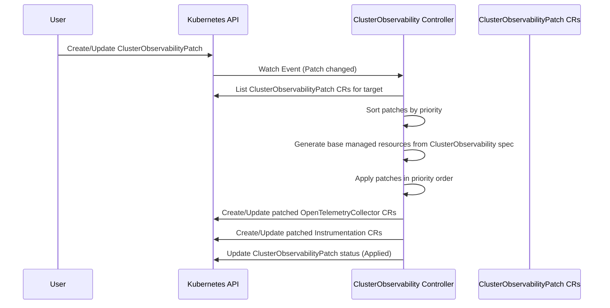

# ClusterObservabilityPatch

**Status:** *Draft*

**Author:** Benedikt Bongartz (@frzifus)

**Date:** 2026-05-26

**Related Issue:** https://github.com/open-telemetry/opentelemetry-operator/issues/5122

## Objective

Provide a mechanism for users to customize the resources generated by the `ClusterObservability` CR without
requiring the CR itself to expose every possible configuration option, and without resorting to external
tools like kustomize that introduce race conditions (patch-after-create).

## Summary

This RFC proposes a new `ClusterObservabilityPatch` custom resource that allows users to apply targeted
modifications to the `OpenTelemetryCollector` and `Instrumentation` CRs managed by a `ClusterObservability`
resource. The design follows the policy-attachment pattern used by
[EnvoyPatchPolicy](https://gateway.envoyproxy.io/docs/tasks/extensibility/envoy-patch-policy/) in Envoy
Gateway, adapted to the OpenTelemetry operator's domain.

The `ClusterObservability` CR intentionally keeps its API surface small — it delivers opinionated best
practices out of the box. However, real-world deployments inevitably need to deviate from defaults:
disabling log collection for a chatty service, tuning resource detection parameters, pinning a collector
image version, adjusting processor settings, configuring specific transport settings, or wiring the data
export into different datastores available on a platform like OpenShift. The `ClusterObservabilityPatch` CR
bridges this gap by letting users express overrides declaratively as a separate resource, which the
`ClusterObservability` controller applies *before* creating or updating the managed CRs. This also enables
vendors to ship their own small patch files that make platform-specific integration seamless — for example,
an OpenShift distribution could include a `ClusterObservabilityPatch` that routes telemetry to the
platform's built-in observability stack without requiring end users to understand the underlying wiring.

## Goals and non-goals

### Goals

- Allow users to override fields on managed `OpenTelemetryCollector` and `Instrumentation` CRs produced
  by a `ClusterObservability` resource.
- Support common customization scenarios: image overrides, collector config processor/receiver tuning,
  resource limits, environment variables, and volume mounts.
- Patches are applied atomically during reconciliation — no race condition between resource creation and
  patching.
- Patches are validated at admission time where possible (target exists, patch structure is valid).
- Multiple `ClusterObservabilityPatch` resources can coexist with deterministic ordering via a priority field.
- Report patch application status back to the user via conditions on the `ClusterObservabilityPatch` status.

### Non-goals

- Replacing the `ClusterObservability` CR's built-in configuration (exporter settings remain on the parent CR).
- Providing a general-purpose patching mechanism for arbitrary Kubernetes resources.
- Supporting removal or replacement of entire managed components (e.g., deleting the agent collector entirely).
- Patching resources outside the `opentelemetry.io` API group.

## Use cases for proposal

### Tune collector processor configuration

A user wants to change the `resourcedetection` processor to use specific detectors on their platform:

```yaml
apiVersion: opentelemetry.io/v1alpha1
kind: ClusterObservabilityPatch
metadata:
  name: custom-resource-detection
  namespace: observability
spec:
  targetRef:
    name: cluster-observability
  patches:
    - target:
        kind: OpenTelemetryCollector
        name: agent
      type: merge
      value:
        spec:
          config:
            processors:
              resourcedetection:
                detectors: ["env", "system", "k8snode", "kubeadm"]
                timeout: 2s
```

### Override collector image version

A user needs to pin a specific collector image version for compliance or testing:

```yaml
apiVersion: opentelemetry.io/v1alpha1
kind: ClusterObservabilityPatch
metadata:
  name: pin-collector-version
  namespace: observability
spec:
  targetRef:
    name: cluster-observability
  patches:
    - target:
        kind: OpenTelemetryCollector
        name: agent
      type: merge
      value:
        spec:
          image: ghcr.io/open-telemetry/opentelemetry-collector-releases/opentelemetry-collector-contrib:0.105.0
    - target:
        kind: OpenTelemetryCollector
        name: cluster
      type: merge
      value:
        spec:
          image: ghcr.io/open-telemetry/opentelemetry-collector-releases/opentelemetry-collector-contrib:0.105.0
```

### Disable log collection on the agent

A user wants to disable the filelog receiver on agents to reduce noise or because logs are collected
via a different mechanism:

```yaml
apiVersion: opentelemetry.io/v1alpha1
kind: ClusterObservabilityPatch
metadata:
  name: disable-log-collection
  namespace: observability
spec:
  targetRef:
    name: cluster-observability
  patches:
    - target:
        kind: OpenTelemetryCollector
        name: agent
      type: jsonPatch
      ops:
        - op: remove
          path: /spec/config/receivers/filelog
        - op: remove
          path: /spec/config/service/pipelines/logs
```

### Add resource limits to collectors

A user wants to set specific resource requests and limits on collector pods:

```yaml
apiVersion: opentelemetry.io/v1alpha1
kind: ClusterObservabilityPatch
metadata:
  name: collector-resources
  namespace: observability
spec:
  targetRef:
    name: cluster-observability
  patches:
    - target:
        kind: OpenTelemetryCollector
        name: agent
      type: merge
      value:
        spec:
          resources:
            limits:
              cpu: "500m"
              memory: "512Mi"
            requests:
              cpu: "100m"
              memory: "128Mi"
```

### Vendor-provided platform integration

A vendor can ship a patch that wires telemetry export into the platform's built-in
observability datastores. End users install this patch alongside the `ClusterObservability` CR
and get platform-native integration without manual configuration:

```yaml
apiVersion: opentelemetry.io/v1alpha1
kind: ClusterObservabilityPatch
metadata:
  name: openshift-logging-integration
  namespace: observability
spec:
  targetRef:
    name: cluster-observability
  priority: 100
  patches:
    - target:
        kind: OpenTelemetryCollector
        name: agent
      type: merge
      value:
        spec:
          config:
            exporters:
              otlp/platform-logs:
                endpoint: "loki.openshift-logging.svc:4317"
                tls:
                  insecure: true
            service:
              pipelines:
                logs:
                  exporters: ["otlp/platform-logs"]
```

## Struct Design

```go
// ClusterObservabilityPatchSpec defines the desired state of ClusterObservabilityPatch.
type ClusterObservabilityPatchSpec struct {
    // TargetRef identifies the ClusterObservability resource this patch applies to.
    // +required
    TargetRef ClusterObservabilityTargetRef `json:"targetRef"`

    // Priority determines the order in which patches are applied when multiple
    // ClusterObservabilityPatch resources target the same ClusterObservability.
    // Lower values are applied first. Default is 0.
    // +optional
    // +kubebuilder:default=0
    Priority int32 `json:"priority,omitempty"`

    // Patches is the list of patches to apply to managed resources.
    // +required
    // +kubebuilder:validation:MinItems=1
    Patches []ResourcePatch `json:"patches"`
}

// ClusterObservabilityTargetRef identifies the ClusterObservability resource to patch.
type ClusterObservabilityTargetRef struct {
    // Name is the name of the ClusterObservability resource.
    // +required
    Name string `json:"name"`
}

// ResourcePatch defines a patch to apply to a specific managed resource.
type ResourcePatch struct {
    // Target identifies which managed resource to patch.
    // +required
    Target PatchTarget `json:"target"`

    // Type specifies the patch strategy.
    // "merge" performs a strategic merge patch on the target resource's spec.
    // "jsonPatch" applies RFC 6902 JSON Patch operations.
    // +required
    // +kubebuilder:validation:Enum=merge;jsonPatch
    Type PatchType `json:"type"`

    // Value contains the merge patch content. Used when type is "merge".
    // The structure should mirror the target resource's spec.
    // +optional
    Value *apiextensionsv1.JSON `json:"value,omitempty"`

    // Ops contains JSON Patch operations. Used when type is "jsonPatch".
    // +optional
    Ops []JSONPatchOp `json:"ops,omitempty"`
}

// PatchTarget identifies a managed resource by kind and name.
type PatchTarget struct {
    // Kind is the kind of the managed resource.
    // +required
    // +kubebuilder:validation:Enum=OpenTelemetryCollector;Instrumentation
    Kind string `json:"kind"`

    // Name is the name suffix of the managed resource (e.g., "agent", "cluster").
    // This corresponds to the component name used by the ClusterObservability controller.
    // +required
    Name string `json:"name"`
}

// PatchType is the type of patch to apply.
type PatchType string

const (
    // PatchTypeMerge performs a strategic merge patch.
    PatchTypeMerge PatchType = "merge"
    // PatchTypeJSONPatch applies RFC 6902 JSON Patch operations.
    PatchTypeJSONPatch PatchType = "jsonPatch"
)

// JSONPatchOp represents a single RFC 6902 JSON Patch operation.
type JSONPatchOp struct {
    // Op is the operation to perform: add, remove, replace, move, copy, or test.
    // +required
    // +kubebuilder:validation:Enum=add;remove;replace;move;copy;test
    Op string `json:"op"`

    // Path is a JSON Pointer (RFC 6901) to the target location.
    // +required
    Path string `json:"path"`

    // Value is the value to use for add or replace operations.
    // +optional
    Value *apiextensionsv1.JSON `json:"value,omitempty"`

    // From is the source path for move or copy operations.
    // +optional
    From string `json:"from,omitempty"`
}

// ClusterObservabilityPatchStatus defines the observed state of ClusterObservabilityPatch.
type ClusterObservabilityPatchStatus struct {
    // Conditions represent the latest available observations of the patch state.
    // +optional
    Conditions []metav1.Condition `json:"conditions,omitempty"`

    // ObservedGeneration is the most recent generation observed.
    // +optional
    ObservedGeneration int64 `json:"observedGeneration,omitempty"`
}
```

### Condition types

| Type | Meaning |
|------|---------|
| `Accepted` | The patch resource has been validated and accepted by the controller. |
| `Applied` | The patches were successfully applied to the managed resources during the last reconciliation. |

### CRD YAML sketch

```yaml
apiVersion: apiextensions.k8s.io/v1
kind: CustomResourceDefinition
metadata:
  name: clusterobservabilitypatches.opentelemetry.io
spec:
  group: opentelemetry.io
  names:
    kind: ClusterObservabilityPatch
    listKind: ClusterObservabilityPatchList
    plural: clusterobservabilitypatches
    singular: clusterobservabilitypatch
    shortNames:
      - co11ypatch
  scope: Namespaced
  versions:
    - name: v1alpha1
      served: true
      storage: true
      subresources:
        status: {}
      additionalPrinterColumns:
        - name: Target
          type: string
          jsonPath: .spec.targetRef.name
        - name: Priority
          type: integer
          jsonPath: .spec.priority
        - name: Age
          type: date
          jsonPath: .metadata.creationTimestamp
```

## Controller Interaction Flow



The `ClusterObservability` controller watches `ClusterObservabilityPatch` resources. During reconciliation
it:

1. Generates the base managed resources from its embedded configs and the `ClusterObservability` spec.
2. Lists all `ClusterObservabilityPatch` resources that reference the active `ClusterObservability` via `targetRef`.
3. Sorts them by `priority` (ascending), breaking ties by namespace/name lexicographic order.
4. Applies each patch to the in-memory representation of the managed resources.
5. Creates or updates the final managed resources in the cluster.
6. Updates the status conditions on each `ClusterObservabilityPatch`.

## Alternatives considered

### Inline patches on the ClusterObservability CR

As described in issue #5122, patches could live directly on the `ClusterObservability` spec:

```yaml
spec:
  agent:
    patch:
      config:
        processors:
          resourcedetection:
            detectors: ["env", "system"]
```

**Pros:** Simpler — everything in one resource.
**Cons:** Blurs the boundary between "opinionated defaults" and "user customization." The ClusterObservability
CR was explicitly designed to be minimal. Inline patches also make it harder to apply RBAC separately
(e.g., letting a platform team own the ClusterObservability while app teams submit patches).

### External kustomize / patch-after-create

Users could use kustomize or a controller like kyverno to patch the managed CRs after creation.

**Pros:** No operator changes needed.
**Cons:** Race condition — the managed CR is briefly in an unpatched state. Drift detection in the
ClusterObservability controller will fight with external patchers. The controller currently reconciles
managed CRs back to the desired state, undoing external patches.

### Do nothing

Users who need customization can stop using `ClusterObservability` and manage individual
`OpenTelemetryCollector` / `Instrumentation` CRs directly.

**Pros:** Zero new API surface.
**Cons:** Defeats the purpose of the simplified experience if only a small subset of settings needs
to be tweaked. [e.g. the replica count of the cluster collector(s)]

## Rollout Plan

1. **Feature gate:** Gated behind `operator.clusterobservability` (disabled by default).
2. **Phase 1 — Merge patch only:** Initial implementation supports `type: merge` only. This covers the
   majority of use cases (image overrides, config tuning, resource limits) with minimal risk.
3. **Phase 2 — JSON Patch:** Add `type: jsonPatch` support for advanced operations (remove, move). This
   requires more validation and testing.

## Limitations

- Patches operate on the intermediate CR representation, not on the final Kubernetes resources (Deployments,
  DaemonSets). Users cannot patch pod-level details that are not exposed on the `OpenTelemetryCollector` spec.
- Invalid patches (e.g., referencing a non-existent component name) will be reported via status conditions
  but may not be caught at admission time in all cases.
- The `ClusterObservability` controller's drift reconciliation will overwrite any manual changes to managed
  CRs. Patches must go through `ClusterObservabilityPatch` — this is by design.
- Merge patches on the collector `config` field (which is a string/YAML blob inside the `OpenTelemetryCollector`
  spec) require the controller to parse, merge, and re-serialize the config. Deep merge semantics for
  collector config maps (processors, receivers, exporters) need to be well-defined.
