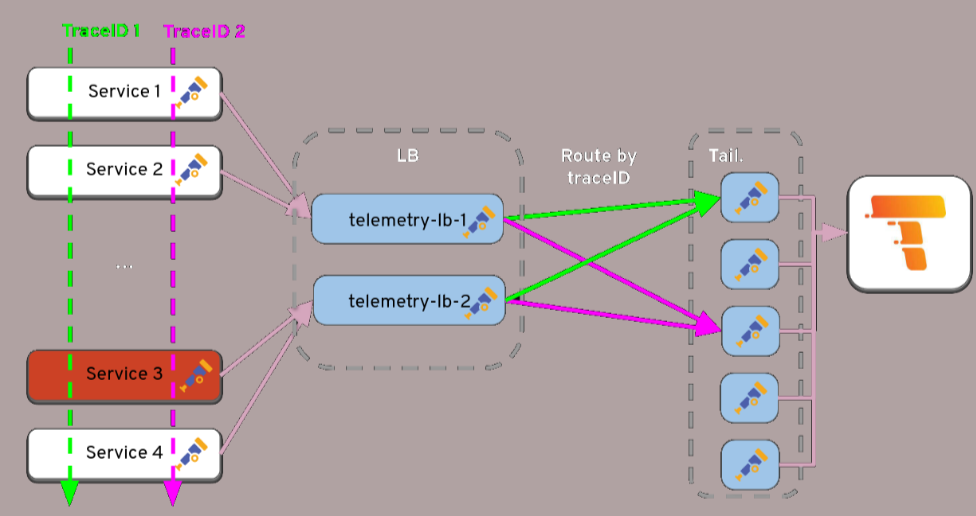

# Opinionated OpenTelemetry Operator Sampling CR

**Status:** [*Draft* | *Accepted*]

**Author:** Benedikt Bongartz, bongartz@redhat.com

**Date:** 20.9.2024

## Objective

By today there is an ongoing discussion about whether and how the collector CR could be split into several components. This would hopefully not only reduce the complexity of some CRs, but also help to manage access to certain collector parts for certain users. As this turned out to be more complicated than expected, and there are some non-trivial setups, it might make sense to experiment with some opinionated CRs for specific use cases. ([#1477](https://github.com/open-telemetry/opentelemetry-operator/pull/1477), [#1906](https://github.com/open-telemetry/opentelemetry-operator/pull/1906)) Based on feedback from a [FOSDEM talk on sampling](https://fosdem.org/2024/schedule/event/fosdem-2024-3445-strategic-sampling-architectural-approaches-to-efficient-telemetry/) and [Kubecon tutorials](https://github.com/pavolloffay/kubecon-eu-2024-opentelemetry-kubernetes-tracing-tutorial), we noticed a request for a sampling CR.

The introduction of this CRD is intended to significantly simplify trace sampling in a kubernetes enviroment.

## Summary

Provide a sampler CR in v1alpha1 that can be used to simplify the sampling of traces in kubernetes. 

## Goals and non-goals

**Goals**
- Provide an opinionated CR to simply sampling configuration in distributed environments
- Allow managing access using RBAC to different parts of the collector configuration
- Adapt the collector setup based on sampling strategy
- Secure the communication between collector components by default

**Non-Goals**
- Solving the generic OpenTelemetryCollector CR split
- Allow extra processing steps within the CR
- Auto scaling he setup (might be a future goal)

## Use cases for proposal

### CASE 1

As a cluster administrator I want to reduce the amount of traffic caused by generating telemetry data.

### CASE 2

As a cluster administrator I want to be in control of the collector resources while allowing a user to change sampling policies.

### CASE 3

As a user I want to be able to filter relevant data without much specific open telemetry knowledge. 

## Struct Design

This proposal introduces a new CR which serve as an abstraction setting up an opentelemetry collector based sampling layer. Similar to the following figure.



This custom resource creates an environment that allows us to apply e.g. tailbased sampling in a distributed environment. The operator takes care of creating an optional otel LB service and sampling instances similar to the figure shown above.

LB instances will be pre-configured to distribute traces based on a given routing key like the traceID to the sampler instances.

A policy is used to define which telemetry data should be sampled. Available policies can be found in the [tailbased sampling description](https://github.com/open-telemetry/opentelemetry-collector-contrib/tree/main/processor/tailsamplingprocessor).

```yaml
---
apiVersion: opentelemetry.io/v1alpha1
kind: Sampler
metadata:
  name: example-sampler
spec:
  # Policies taken into account when making a sampling decision.
  policies:
    - name: "retain-error-policy"
      type: status_code,
      status_codes: [ERROR, UNSET]
  # RoutingKey describes how traffic to be sampled is distributed. It can be 'traceid' or 'service'.
  # Default is 'traceid'.
  routingKey: traceid
  # DecisionWait defines the time to wait before making a sampling decision.
  # Default is 30s, specified in nanoseconds (30s = 30000000000ns).
  decision_wait: 30000000000
  # NumTraces defines the number of traces kept in memory.
  # Default is 5000.
  num_traces: 5000
  # ExpectedNewTracesPerSec defines the expected number of new traces per second.
  # Helps allocate memory structures. Default is 5000.
  expected_new_traces_per_sec: 5000
  # DecisionCache defines the settings for the decision cache.
  # This allows sampling decisions to be cached to avoid re-processing traces.
  decision_cache:
    # SampledCacheSize configures the amount of trace IDs to be kept in an LRU
    # cache, persisting the "keep" decisions for traces that may have already
    # been released from memory.
    # By default, the size is 0 and the cache is inactive.
    # If using, configure this as much higher than num_traces so decisions for
    # trace IDs are kept longer than the span data for the trace.
    sampled_cache_size: 10000
  # Components defines the template of all requirements to configure scheduling
  # of all components to be deployed.
  components:
    loadbalancer:
      # Defines if the component is managed by the operator
      managementState: managed
      resources:  # Resource requests and limits
        limits:
          cpu: "500m"
          memory: "512Mi"
        requests:
          cpu: "200m"
          memory: "256Mi"
      # Node selection for component placement
      nodeSelector:
        environment: "production"
      # Number of load balancer replicas (optional)
      replicas: 2

    sampler:
      # Component managed by the operator
      managementState: managed
      # Number of sampler replicas (optional)
      replicas: 3

  # Telemetry settings for the sampler system (currently empty).
  telemetry:
    # telemetry configuration goes here (e.g., serviceMonitor or spanMetrics)
    ...

  # Exporter configuration. Only OTLP exporter supported.
  exporter:
    # OTLP exporter endpoint
    endpoint: "jaeger:4317"
```

## Rollout Plan

1. Introduction of the CRD in v1alpha1.
2. First controller implementation.
3. Implementation of e2e tests.
4. CRD becomes part of the operator bundle.

## Limitations

1. Initially, there is no TLS support for incoming, internal and outgoing connections.
2. The input and output format is exclusively OTLP.
3. Policies are initially part of the sampling CR and cannot be configured independently of the sampler setup.

